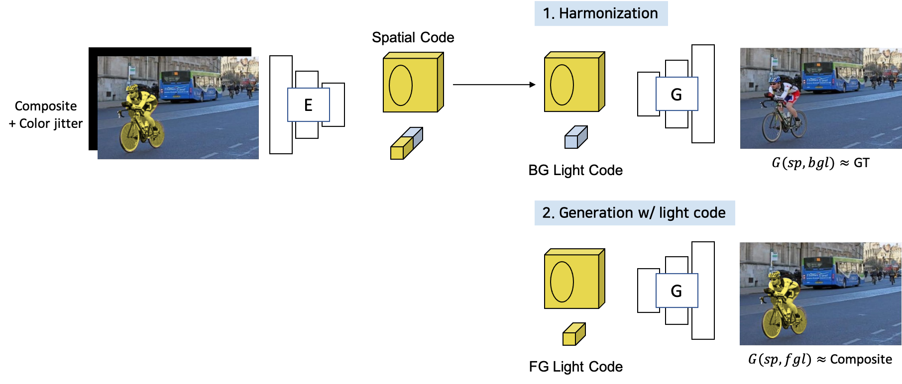

# AE-Harmonization
Deep Image Harmonization Application Inspired from "Swapping Autoencoder for Deep Image Manipulation (NeurIPS 2020)" in PyTorch

## Example Results
</img>

</img>

## Motivation
</img>

## Concept Image
</img>

## Prerequisites

- Linux
- Python 3
- CPU or NVIDIA GPU + CUDA CuDNN

## Datasets
- [iHarmony4](https://github.com/bcmi/Image-Harmonization-Dataset-iHarmony4)

## Train
Run:
```bash 
CUDA_VISIBLE_DEVICES="0,1,2,3,4,5,6,7" python train.py --model iih_base --name iih_base_allidh_test --dataset_root ~/IHD/ --dataset_name IHD --batch_size 80 --init_port 50000
```

## Test
### Train a new model

If you train a new model with the command above, `latest_net_G.pth` will be generated in the directory `checkpoints/iih_base_lt_allihd`.

Run:

```bash
CUDA_VISIBLE_DEVICES="0,1,2,3,4,5,6,7" python test.py --model iih_base --name iih_base_allidh_test --dataset_root ~/IHD/ --dataset_name IHD --batch_size 80 --init_port 50000
```

### Apply pre-trained model
1. Download a pre-trained [model.](https://drive.google.com/file/d/10GSC9D9BB9HuhLFDp44aVeRYFqQ9vtFN/view?usp=sharing)
2. Change their names to `latest_net_G.pth`.
3. Put them in the directory `checkpoints/iih_base_lt_allihd`.
4. Run (use the command above)

## Applications
### Latent Space Exploration
Run:
```bash
python latentspace.py
```

## Acknowledgement
We borrowed some of the data modules and model functions from repo of [IntrinsicHarmony](https://github.com/zhenglab/IntrinsicHarmony), and [Swapping-AE](https://github.com/taesungp/swapping-autoencoder-pytorch).
